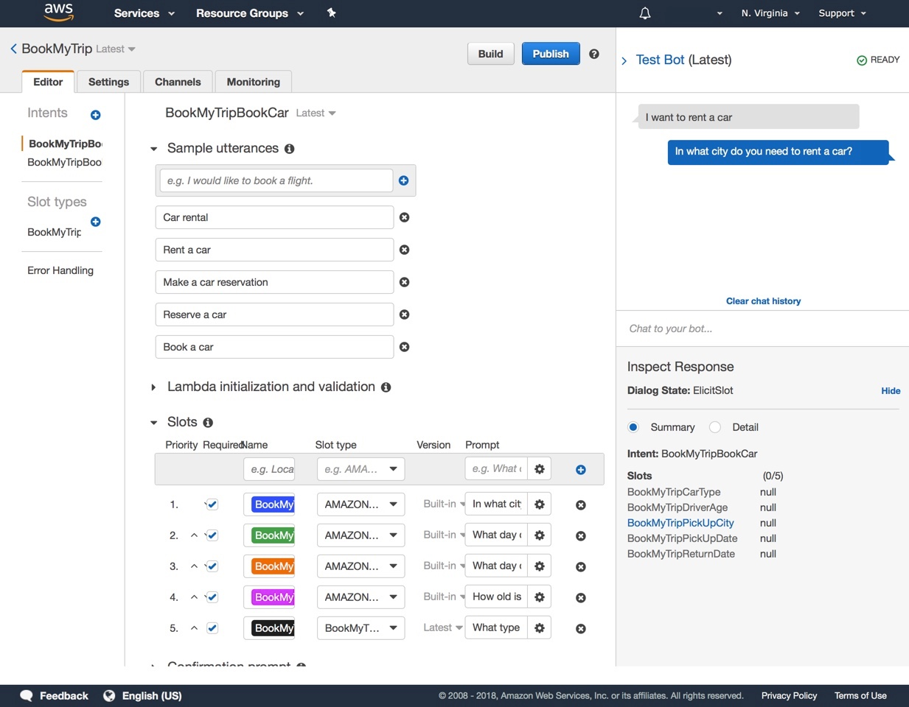

**Last Updated:** June 2020

# Building your Mobile App with Amplify and configuring LEX

## Overview

Amplify is an open-source Framework provides the following products to build fullstack iOS, Android, Web, and React Native apps:

- Amplify CLI - Configure all the services needed to power your backend through a simple command line interface.
- Amplify Libraries - Use case-centric client libraries to integrate your app code with a backend using declarative interfaces.
- Amplify UI Components - UI libraries for React, React Native, Angular, Ionic and Vue.
- Amplify Console - Is an AWS service that provides a git-based workflow for continuous deployment & hosting of fullstack web apps. Cloud resources created by the Amplify CLI are also visible in the Amplify Console.

We'll use Amplify to build a web application in which we can interact with our LEX chat bot from Lab 1.

## Pre-requisites

The following frameworks and package managers are needed to be able to complete Lab 2:
- NodeJS version 10.x and above (https://nodejs.org/en/download/)
- npm version 6.x and above (https://www.npmjs.com/get-npm)

## Step 1: Install the Amplify CLI

1. Run the following command within terminal / powershell:

``` bash
sudo npm install -g @aws-amplify/cli
```

* please note that Amplify CLI will need to be installed globally on your machine hence ``` sudo ``` is needed

2. Configure Amplify by running the following command:

``` bash
amplify configure
```

3. Amplify CLI will ask you to specify the AWS Region. Enter: ```us-east-1```

``` bash
Specify the AWS Region
? region: us-east-1
```

4. Amplify CLI will now ask you to create an IAM user. Enter: ```lex-lab-amplify```

``` bash
Specify the username of the new IAM user:
? user name: lex-lab-amplify
```

5. You will be directed to complete the user creation using the AWS console. Create a user with ```AdministratorAccess``` to your account to provision AWS resources for you like AppSync, Cognito etc.


6. Once the user is created, Amplify CLI will ask you to provide the ```accessKeyId``` and the ```secretAccessKey``` to connect Amplify CLI with your newly created IAM user. Profile Name should be ```lex-lab-amplify-profile```.

``` bash
Enter the access key of the newly created user:
? accessKeyId:  # YOUR_ACCESS_KEY_ID
? secretAccessKey:  # YOUR_SECRET_ACCESS_KEY
This would update/create the AWS Profile in your local machine
? Profile Name:  # (default)

Successfully set up the new user.
```

## Step 2: Create a new Amplify project

1. 

## Step 3: Configure Amplify 
1.  Run the following command in your project’s root folder:

``` bash
amplify add interactions
```

