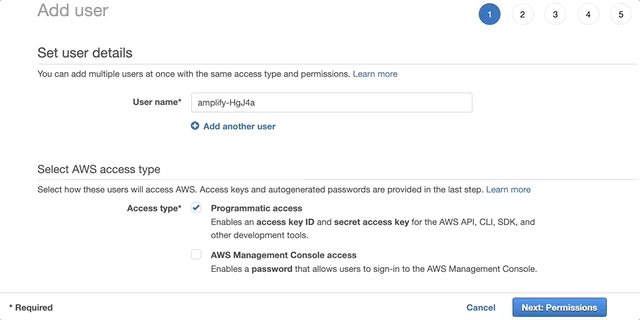
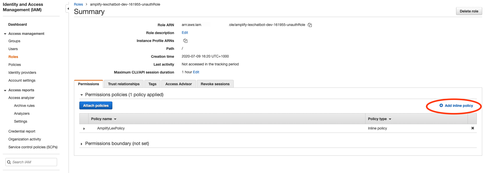
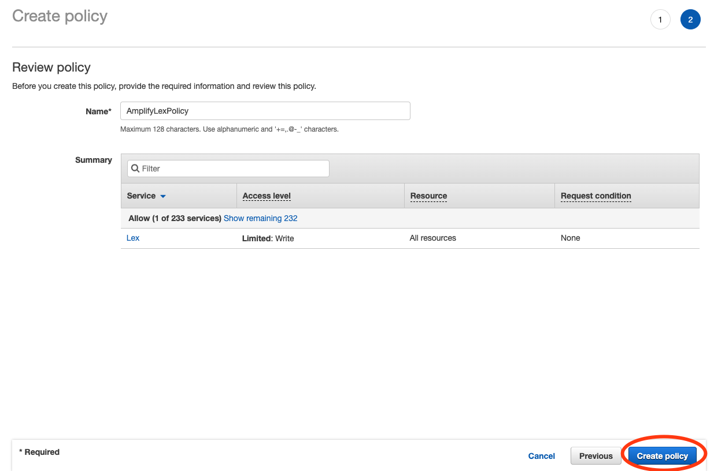
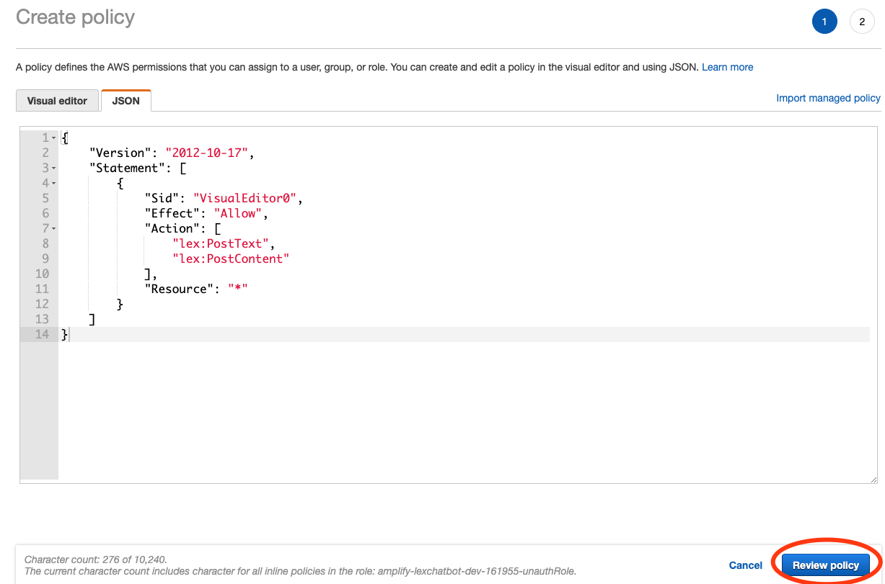

**Last Updated:** June 2020

# Building your Web App with Amplify and configuring LEX

## Overview

Amplify is an open-source Framework provides the following products to build fullstack iOS, Android, Web, and React Native apps:

- Amplify CLI - Configure all the services needed to power your backend through a simple command line interface.
- Amplify Libraries - Use case-centric client libraries to integrate your app code with a backend using declarative interfaces.
- Amplify UI Components - UI libraries for React, React Native, Angular, Ionic and Vue.
- Amplify Console - Is an AWS service that provides a git-based workflow for continuous deployment & hosting of fullstack web apps. Cloud resources created by the Amplify CLI are also visible in the Amplify Console.

We'll use Amplify to build a web application in which we can interact with our LEX chat bot from Lab 1.

## Pre-requisites

The following frameworks and package managers are needed to be able to complete Lab 2:
- NodeJS version 10.x and above (https://nodejs.org/en/download/)
- npm version 6.x and above (https://www.npmjs.com/get-npm)

* please note that NodeJS will generally install npm alongside so the npm link generally will not be needed.

## Step 1: Install the Amplify CLI

1. On your computer, run the following command within terminal / powershell window:

``` bash
npm install -g @aws-amplify/cli
```

* please note that Amplify CLI will need to be installed globally on your machine hence ``` sudo ``` is needed at the front of the command on mac / linux
* It may take up to 5 minutes to complete depending on your internet connection

2. Configure Amplify by running the following command:

``` bash
amplify configure
```

3. Amplify CLI will ask you to specify the AWS Region. Enter: ```us-east-1```

``` bash
Specify the AWS Region
? region: us-east-1
```

4. Amplify CLI will now ask you to create an IAM user. Enter: ```lex-lab-amplify```

``` bash
Specify the username of the new IAM user:
? user name: lex-lab-amplify
```

5. You will be directed to complete the user creation using the AWS console. Create a user with ```AdministratorAccess``` to your account to provision AWS resources for you like AppSync, Cognito etc.



* please note that the user name that you will see may differ to the screenshot above and should say ```lex-lab-amplify```.
* if user creation failed within the AWS console, please repeat steps 2-5.

6. Once the user is created, Amplify CLI will ask you to provide the ```accessKeyId``` and the ```secretAccessKey``` to connect Amplify CLI with your newly created IAM user. Profile Name should be ```lex-lab-amplify-profile```.

``` bash
Enter the access key of the newly created user:
? accessKeyId:  # YOUR_ACCESS_KEY_ID
? secretAccessKey:  # YOUR_SECRET_ACCESS_KEY
This would update/create the AWS Profile in your local machine
? Profile Name:  # (lex-lab-amplify-profile)

Successfully set up the new user.
```

## Step 2: Create a new project
To set up the project, we’ll first create a new React app with create-react-app, a CLI tool used to bootstrap a React app using current best practices. We’ll then add Amplify and initialize a new project.

1. From your projects directory, run the following commands:

``` bash
npx create-react-app react-lexchatbot
cd react-lexchatbot
```

This creates a new React app in a directory called react-lexchatbot and then switches us into that new directory.

* It may take up to 5 minutes for ```npx create-react-app react-lexchatbot``` to run successfully dependant on your internet connection.

2. Now that we’re in the root of the project, we can run the app by using the following command:

``` bash
npm start
```

This runs a development server and allows us to see the output generated by the build, you can see the running app by navigating to ```http://localhost:3000```

## Step 3: Setup Amplify CLI
Now that we have a running React app, it’s time to set up Amplify so that we can create the necessary backend services needed to support the app.

1. From the root of the project, launch a second terminal window / powershell window and run:

``` bash
amplify init
```

2. When you initialize Amplify you’ll be prompted for some information about the app. Firstly provide a name for the project - let's go with ```lexchatbot```.

``` bash
Enter a name for the project (lexchatbot)
```

3. You will then be asked for an name for your environment - call it ```dev```

``` bash
# All AWS services you provision for your app are grouped into an "environment"
# A common naming convention is dev, staging, and production
Enter a name for the environment (dev)
```

4. You will then be prompted for your default editor - choose ```Visual Studio Code``` and tap ```enter```.

``` bash
# Sometimes the CLI will prompt you to edit a file, it will use this editor to open those files.
Choose your default editor
> Visual Studio Code
...
```

5. Select ```javascript``` as the type of app you are building.

``` bash
# Amplify supports JavaScript (Web & React Native), iOS, and Android apps
Choose the type of app that you're building (javascript)
android
ios
> javascript
```

6. Choose ```react``` as the javascript framework we will use.

``` bash
What javascript framework are you using?
angular
ember
ionic
> react
react-native
vue
none
```

7. Leave the src path as default by pressing ```enter```.

``` bash
Source directory path (src)
```

8. Leave the distribution directory path as default by pressing ```enter```.

``` bash
Distribution directory path (build)
```

9. Leave the build command as default by pressing ```enter```.

``` bash
Build command (npm run-script build)
```

10. Leave the start command as default by pressing ```enter```.

``` bash
Start command (npm run-script start)
```

11. Type ```Y``` to use an AWS profile and then select ```lex-lab-amplify-profile```.

``` bash
# This is the profile you created with the `amplify configure` command in the introduction step.
Do you want to use an AWS profile (Y/n): Y
default
> lex-lab-amplify-profile
```

When you initialize a new Amplify project, a few things happen:

* It creates a top level directory called amplify that stores your backend definition. As you add features, the amplify folder will grow with infrastructure-as-code templates that define your backend stack. Infrastructure-as-code is a best practice way to create a replicable backend stack.

* It creates a file called aws-exports.js in the src directory that holds all the configuration for the services you create with Amplify. This is how the Amplify client is able to get the necessary information about your backend services.

* It modifies the .gitignore file, adding some generated files to the ignore list

* A cloud project is created for you in the AWS Amplify Console that can be accessed by running amplify console. The Console provides a list of backend environments, deep links to provisioned resources per Amplify category, status of recent deployments, and instructions on how to promote, clone, pull, and delete backend resources

## Step 4: Configure Amplify for the App
1. The first step to using Amplify in the client is to install the necessary dependencies:

``` bash
npm install aws-amplify aws-amplify-react
```

The aws-amplify package is the main library for working with Amplify in your apps. 
The aws-amplify-react package includes React specific UI components we’ll use as we build the app.

Now that our React app is set up and Amplify is initialized, we’re ready to add LEX in the next step.

## Step 5: Set up Amazon LEX within the App
1. Firstly we will need to set up an unauthenticated user so that we can call LEX from within our App. Run the following within the Amplify CLI:

```bash
amplify add auth
```

2. Choose ```default configuration``` within the CLI options, followed by ```username``` and ```No, I am done```

3. Within you text editor open ```parameters.json``` found within the ``amplify -> backend -> auth``` subfolder and update the ```allowUnauthenticatedIdentities``` to be ```true``` and save the file.

4. Run the following to send the authentication update we made to the Amplify cloud environment:

```bash
amplify push
```

4. Open the AWS Console navigate to the IAM Service. Within the ```Access Management -> Roles``` section search for a role beginning with ```amplify-lexchatbot-dev``` and ending with ```unauthRole``` and click on it.


5. Click on the ``Add inline policy`` button and add the following json within the json tab, name the policy ```AmplifyLexPolicy``` and click ```create policy```.

```json
{
    "Version": "2012-10-17",
    "Statement": [
        {
            "Sid": "VisualEditor0",
            "Effect": "Allow",
            "Action": [
                "lex:PostText",
                "lex:PostContent"
            ],
            "Resource": "*"
        }
    ]
}
```




6. Next, we need to modify **src/App.js** within our project folder and replace the existing code with the following:

``` javascript
import React, { Component } from 'react';
import Amplify, { Interactions } from 'aws-amplify';
import { ChatBot, AmplifyTheme } from 'aws-amplify-react';

Amplify.configure({
  aws_project_region: 'us-east-1',
  Auth: {
    identityPoolId: 'X',
    region: 'us-east-1'
  },
  bots: {
    "PersonalBanker": {
      "name": "PersonalBanker",
      "alias": "$LATEST",
      "region": "us-east-1",
    },
  }

});

// Imported default theme can be customized by overloading attributes
const myTheme = {
  ...AmplifyTheme,
  sectionHeader: {
    ...AmplifyTheme.sectionHeader,
    backgroundColor: '#ff6600'
  }
};

class App extends Component {

  handleComplete(err, confirmation) {
    if (err) {
      alert('Bot conversation failed')
      return;
    }

    alert('Success: ' + JSON.stringify(confirmation, null, 2));
    return 'Thank you! what would you like to do next?';
  }

  render() {
    return (
      <div className="App">
        <header className="App-header">
          <h1 className="App-title">Welcome to ChatBot Demo</h1>
        </header>
        <ChatBot
          title="Banking Bot"
          theme={myTheme}
          botName="PersonalBanker"
          welcomeMessage="Welcome, how can I help you today?"
          onComplete={this.handleComplete.bind(this)}
          clearOnComplete={true}
          conversationModeOn={false}
        />
      </div>
    );
  }
}

export default App;
```

To break this down - the following code add Amplify into your react project:

``` javascript
import Amplify, { Interactions } from 'aws-amplify';
import { ChatBot, AmplifyTheme } from 'aws-amplify-react';
```

The following code configure both the cognito unauthenticated user pool and settings for our Lex Chatbot to be used within our app:

``` javascript
Amplify.configure({
  aws_project_region: 'us-east-1',
  Auth: {
    identityPoolId: 'X',
    region: 'us-east-1'
  },
  bots: {
    "PersonalBanker": {
      "name": "PersonalBanker",
      "alias": "$LATEST",
      "region": "us-east-1",
    },
  }

});
```

The following code renders our chatbot component and provide functionality within react:

``` javascript
<ChatBot
          title="Banking Bot"
          theme={myTheme}
          botName="PersonalBanker"
          welcomeMessage="Welcome, how can I help you today?"
          onComplete={this.handleComplete.bind(this)}
          clearOnComplete={true}
          conversationModeOn={false}
        />
```

The following code handles the event once our chatbot journey is complete:

```javascript
handleComplete(err, confirmation) {
    if (err) {
      alert('Bot conversation failed')
      return;
    }

    alert('Success: ' + JSON.stringify(confirmation, null, 2));
    return 'Thank you! what would you like to do next?';
  }
```

And the following code styles the chatbot ui component:

``` javascript
const myTheme = {
  ...AmplifyTheme,
  sectionHeader: {
    ...AmplifyTheme.sectionHeader,
    backgroundColor: '#ff6600'
  }
};
```

7. Within the code above replace the ```x``` value for ```identityPoolId``` with the ```aws_cognito_identity_pool_id``` value that can be found within your projects **aws-exports.js** file. This will allow our Amplify web app to use the Cognito pool we configured for un-authenticated users when calling Amazon Lex.

8. You should now be able to navigate to ```http://localhost:3000/``` within your web browser and see the chatbot window appear. If you provide the bot a sample utterance such as ```how much money is in my account``` you should see a response from your Amazon LEX chatbot!

Congratulations on finishing the Lab :D


